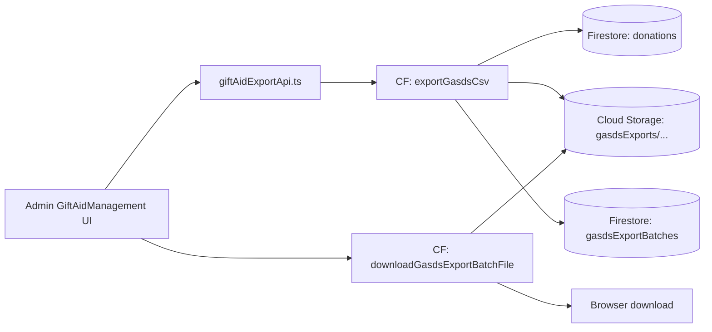
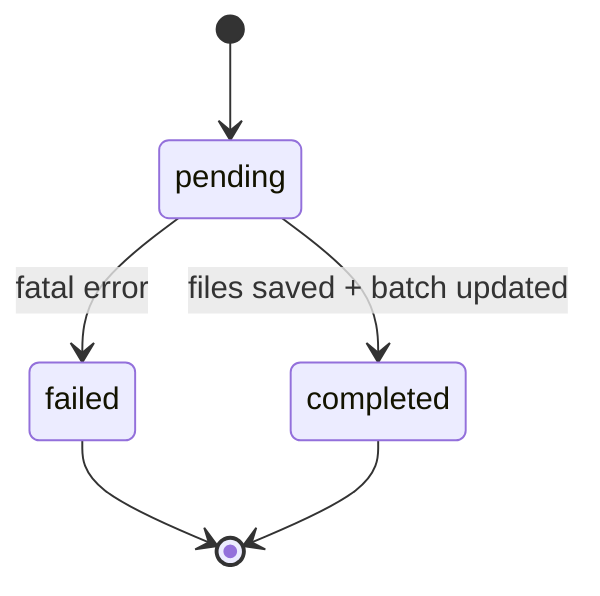
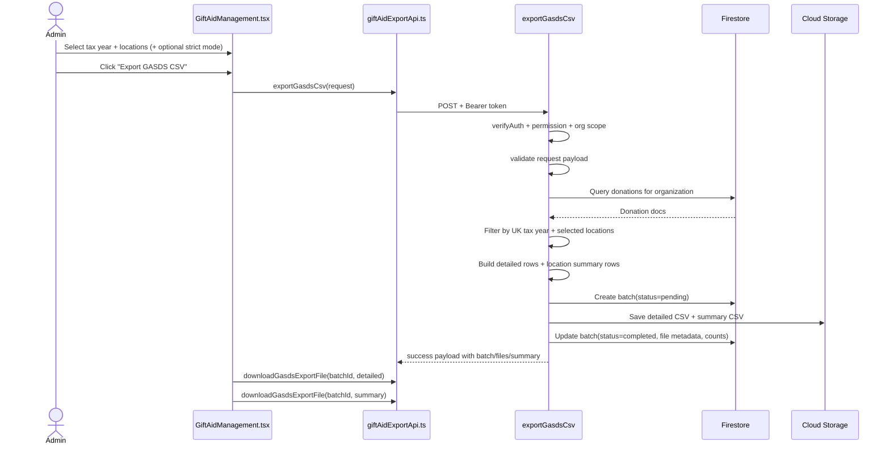

# GASDS Export Flow

## 1) Purpose

This document explains the GASDS export flow end-to-end:

- what the flow does
- how tax year and location filtering work
- how detailed and summary CSVs are generated
- how batch history and file re-download work
- what security and permission controls are enforced

---

## 2) Scope

### In Scope

- Exporting donation-level GASDS CSV for a selected UK tax year
- Optional location filtering (multi-select, default all selected)
- Strict export mode (eligible rows only)
- Eligibility flag + ineligibility reason classification
- Per-location summary CSV
- Batch history persistence and re-download
- CSV safety hardening (formula injection guard + escaping)

### Out of Scope

- HMRC submission integration
- Cap enforcement in export output
- 10:1 Gift Aid matching logic

---

## 3) File Map

### Backend

- `backend/functions/handlers/giftAid.js`
  - `exportGasdsCsv`
  - `downloadGasdsExportBatchFile`
  - auth + permission + org checks
  - tax year/date filtering
  - location filtering
  - detailed + summary CSV generation
  - GASDS batch lifecycle persistence

- `backend/functions/index.js`
  - function registrations:
    - `exportGasdsCsv`
    - `downloadGasdsExportBatchFile`

### Frontend

- `src/entities/giftAid/api/giftAidExportApi.ts`
  - `exportGasdsCsv(...)`
  - GASDS export history fetch (paginated)
  - GASDS batch file download

- `src/shared/lib/hooks/useGasdsExportBatches.ts`
  - paginated GASDS batch history hook

- `src/views/admin/GiftAidManagement.tsx`
  - GASDS section UI
  - tax year selector
  - location multi-select
  - strict mode toggle
  - compliance note
  - location summary table
  - ineligibility summary display
  - batch history with detailed/summary re-download

- `src/shared/config/functions.ts`
  - `FUNCTION_URLS.exportGasdsCsv`
  - `FUNCTION_URLS.downloadGasdsExportBatchFile`

---

## 4) High-Level Architecture



---

## 5) Export Batch Lifecycle



---

## 6) End-to-End Sequence



---

## 7) Request Contract

### Export Endpoint

- `POST /exportGasdsCsv`

Request body:

```json
{
  "organizationId": "org_123",
  "taxYear": "2025-2026",
  "locationIds": ["loc_a", "loc_b"],
  "strictMode": false
}
```

Validation:

- `organizationId` required
- `taxYear` must be `YYYY-YYYY` and contiguous
- `locationIds` must include at least one location
- `strictMode` optional boolean

### Download Endpoint

- `POST /downloadGasdsExportBatchFile`

Request body:

```json
{
  "batchId": "batch_abc",
  "fileKind": "detailed"
}
```

`fileKind` must be:

- `detailed`
- `summary`

---

## 8) Permission Model

GASDS export uses existing Gift Aid export permissions:

- create export: `export_giftaid` or `system_admin`
- download export batch files: `download_giftaid_exports` or `system_admin`

Org scope:

- non-privileged users can only operate on their own organization
- privileged (`super_admin`) can cross org boundary

---

## 9) Tax Year Logic (UK)

Tax year boundary:

- start: `6 April 00:00:00.000 UTC`
- end: `5 April 23:59:59.999 UTC` (next year)

Example:

- `2025-2026` means `2025-04-06` through `2026-04-05`

Only donations in this range are considered.

---

## 10) Donation Selection Rules

A donation row is considered when all are true:

1. organization matches request
2. `location_id` exists and is in selected `locationIds`
3. effective donation date is within selected UK tax year range

Effective date precedence:

1. `paymentCompletedAt`
2. `timestamp`
3. `createdAt`

---

## 11) Eligibility and Strict Mode

Eligibility rule:

- `is_gasds_eligible = (amount <= 30) AND (campaign_mode == "DONATION")`

Mode behavior:

- default mode: include all matched rows; ineligible rows carry a reason
- strict mode: include only eligible rows in detailed CSV

Ineligibility reason values:

- `over_30`
- `non_donation_mode`
- `over_30_and_non_donation_mode`
- empty string when eligible

---

## 12) CSV Schemas

### 12.1 Detailed GASDS CSV

Header order:

1. `donation_id`
2. `amount`
3. `date`
4. `method`
5. `location_name`
6. `postcode`
7. `address_line1`
8. `tax_year`
9. `campaign_mode`
10. `is_gasds_eligible`
11. `gift_aid_matched_in_same_year`
12. `reason_not_eligible`

Field source note:

- `amount` comes from `donation.amount` (stored in minor units) and is converted to major units for CSV output
- `location_name` and `postcode` come from `donation.location_snapshot`
- `address_line1` uses `location_snapshot.addressLine1` when present
- fallback for legacy snapshots uses `location_snapshot.city` when `addressLine1` is absent

### 12.2 Location Summary CSV

Header order:

1. `location_id`
2. `location_name`
3. `postcode`
4. `total_collected`
5. `eligible`
6. `cap`
7. `status`
8. `community_building_note`

---

## 13) Batch Storage and Metadata

Collection:

- `gasdsExportBatches`

Stored files:

- `gasdsExports/{organizationId}/{batchId}/{fileName}.csv`

Batch metadata includes:

- creator identity
- tax year
- strict mode
- selected location IDs
- row counts
- reason counts
- file metadata (`fileName`, `storagePath`, `sha256`, `sizeBytes`)
- lifecycle status (`pending`, `completed`, `failed`)

---

## 14) UI Behavior

`GiftAidManagement.tsx` GASDS section includes:

- UK tax year selector label clarified as scheme year
- compliance note:
  - eligibility is indicative; final HMRC checks still required
- location multi-select (all selected by default)
- strict mode toggle
- per-location summary table with cap/status
- ineligibility reason count summary
- GASDS batch history with detailed/summary re-download actions

---

## 15) Security Controls

### 15.1 Auth + Authorization

- Firebase token verification
- permission checks
- organization scope checks

### 15.2 CSV Formula Injection Hardening

Before escaping CSV:

- if a string starts (including leading whitespace/tab/newline) with `=`, `+`, `-`, or `@`
- prefix with `'`

Then apply normal CSV escaping for quotes/commas/newlines.

---

## 16) Error Handling

Common errors:

- `400` invalid request payload
- `403` permission/org scope violations
- `404` batch/file not found during download
- `405` wrong HTTP method
- `500` unhandled server error

On export failure after batch creation:

- batch status is set to `failed`
- `failureMessage` and `failedAt` are recorded

---

## 17) Tests

Boundary coverage added for UK tax year logic:

- `5 April 23:59:59.999` remains in previous tax year
- `6 April 00:00:00.000` moves to next tax year
- range parsing validates `YYYY-YYYY` contiguity

Test file:

- `backend/functions/handlers/giftAid.gasds.test.js`

---

## 18) Quick Reference

Backend:

- `exportGasdsCsv`
- `downloadGasdsExportBatchFile`

Frontend API:

- `exportGasdsCsv(...)`
- `fetchGasdsExportBatchesPaginated(...)`
- `downloadGasdsExportFile(...)`

UI:

- GASDS panel in `src/views/admin/GiftAidManagement.tsx`
