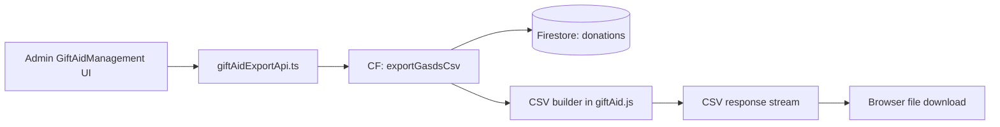
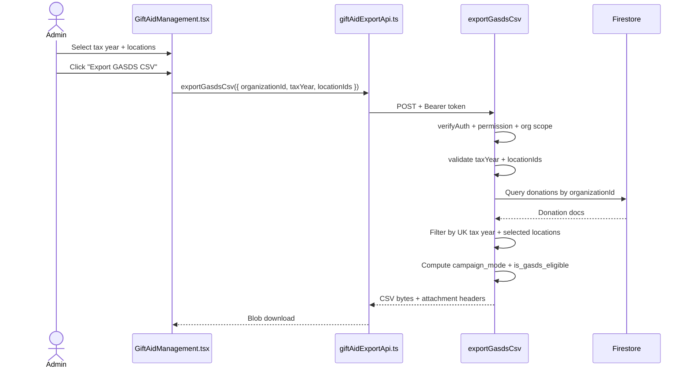

# GASDS Export Flow

## 1) Purpose

This document explains the GASDS export flow end-to-end:

- what the flow does
- how tax year and location filtering work
- how CSV rows are constructed
- what security and permission controls are enforced

This is the **GASDS CSV export** flow from Admin Gift Aid.

---

## 2) Scope

### In Scope

- Exporting donation-level GASDS CSV for a selected UK tax year
- Optional location filtering (multi-select, default all selected)
- Per-donation eligibility flag calculation:
  - `is_gasds_eligible = (amount <= 30) AND (campaign_mode == "DONATION")`
- CSV safety hardening (formula injection guard + escaping)

### Out of Scope

- HMRC submission integration
- Cap enforcement in export output
- 10:1 Gift Aid matching logic
- Batch history persistence (not implemented for GASDS yet)

---

## 3) File Map

### Backend

- `backend/functions/handlers/giftAid.js`
  - `exportGasdsCsv`
  - auth + permission + org checks
  - tax year/date filtering
  - location filtering
  - GASDS CSV generation

- `backend/functions/index.js`
  - function registration:
    - `exportGasdsCsv`

### Frontend

- `src/entities/giftAid/api/giftAidExportApi.ts`
  - `exportGasdsCsv(...)` API call
  - authenticated request + browser download trigger

- `src/views/admin/GiftAidManagement.tsx`
  - GASDS section UI
  - tax year selector
  - location multi-select
  - location summary table
  - export action button

- `src/shared/config/functions.ts`
  - `FUNCTION_URLS.exportGasdsCsv`

---

## 4) High-Level Architecture



---

## 5) End-to-End Sequence



---

## 6) Request Contract

Endpoint:

- `POST /exportGasdsCsv`

Body:

```json
{
  "organizationId": "org_123",
  "taxYear": "2025-2026",
  "locationIds": ["loc_a", "loc_b"]
}
```

Validation:

- `organizationId` required
- `taxYear` must be `YYYY-YYYY` and contiguous (example: `2025-2026`)
- `locationIds` must include at least one location

---

## 7) Permission Model

GASDS export uses the Gift Aid export permission gate:

- required permission: `export_giftaid` (or `system_admin`)
- organization scope:
  - non-privileged users can export only their own organization
  - privileged (`super_admin`) can cross organization boundaries

---

## 8) Tax Year Logic (UK)

Tax year boundary:

- start: `6 April 00:00:00.000 UTC`
- end: `5 April 23:59:59.999 UTC` (next year)

Example:

- `2025-2026` means `2025-04-06` through `2026-04-05`

Only donations within this range are exported.

---

## 9) Donation Selection Rules

A donation is exported when all are true:

1. `organizationId` matches request
2. `location_id` exists and is in selected `locationIds`
3. effective donation date is inside selected UK tax year range

Effective date precedence:

1. `paymentCompletedAt`
2. `timestamp`
3. `createdAt`

---

## 10) CSV Schema

Header order:

1. `donation_id`
2. `amount`
3. `date`
4. `method`
5. `location_name`
6. `postcode`
7. `address_line1`
8. `tax_year`
9. `campaign_mode`
10. `is_gasds_eligible`

Field sources:

- `donation_id`: `transactionId` fallback `stripePaymentIntentId` fallback document id
- `amount`: `donation.amount` (formatted to 2 decimal places)
- `date`: ISO string from effective donation date
- `method`: `donation.platform` fallback `unknown`
- `location_name`, `postcode`, `address_line1`: `donation.location_snapshot`
- `tax_year`: selected tax year label
- `campaign_mode`: resolved from:
  - `campaign_mode`
  - `campaignMode`
  - `metadata.campaign_mode`
  - `metadata.campaignMode`
  - fallback `DONATION`
- `is_gasds_eligible`: `true|false`

---

## 11) Eligibility Logic

Eligibility is flagged, not filtered:

- `is_gasds_eligible = (amount <= 30) AND (campaign_mode == "DONATION")`

All matched donations are included in CSV, regardless of eligibility.

---

## 12) UI Behavior (Admin Gift Aid)

`GiftAidManagement.tsx` GASDS section provides:

- tax year selector (recent tax years)
- location checkbox list (all selected by default)
- summary table by selected location:
  - Total Collected
  - Eligible
  - Cap (`£8,000`)
  - Status (`OK` / `Exceeds`)
  - community building note for potential `£16k` cap

Validation in UI before export:

- tax year must be selected
- at least one location must be selected

---

## 13) Security Controls

### Auth and Authorization

- Firebase token verification on backend
- permission and org scope enforcement in cloud function

### CSV Formula Injection Hardening

Before CSV escaping:

- if a cell starts (including leading whitespace/newline/tab) with `=`, `+`, `-`, or `@`
- value is prefixed with `'`

Then standard CSV escaping is applied for quotes, commas, and line breaks.

---

## 14) Error Handling

Typical responses:

- `400` invalid input (`taxYear`, missing location selection, missing organization id)
- `403` permission or org scope violation
- `405` method not allowed
- `500` unhandled server failure

On success:

- returns CSV file bytes with:
  - `Content-Type: text/csv; charset=utf-8`
  - `Content-Disposition: attachment; filename="gasds-{organizationId}-{taxYear}.csv"`
  - `Cache-Control: private, no-store, max-age=0`

---

## 15) Known Differences vs Gift Aid Export

Current GASDS export is **on-demand streaming**:

- no batch doc persisted
- no Cloud Storage file persistence
- no checksum (`sha256`) metadata
- no re-download history endpoint

This can be extended later if parity with Gift Aid batch governance is required.

---

## 16) Quick Reference

Backend function:

- `exportGasdsCsv` in `backend/functions/handlers/giftAid.js`

Function registration:

- `exports.exportGasdsCsv` in `backend/functions/index.js`

Frontend API bridge:

- `exportGasdsCsv(...)` in `src/entities/giftAid/api/giftAidExportApi.ts`

Admin UI entry:

- GASDS section in `src/views/admin/GiftAidManagement.tsx`
