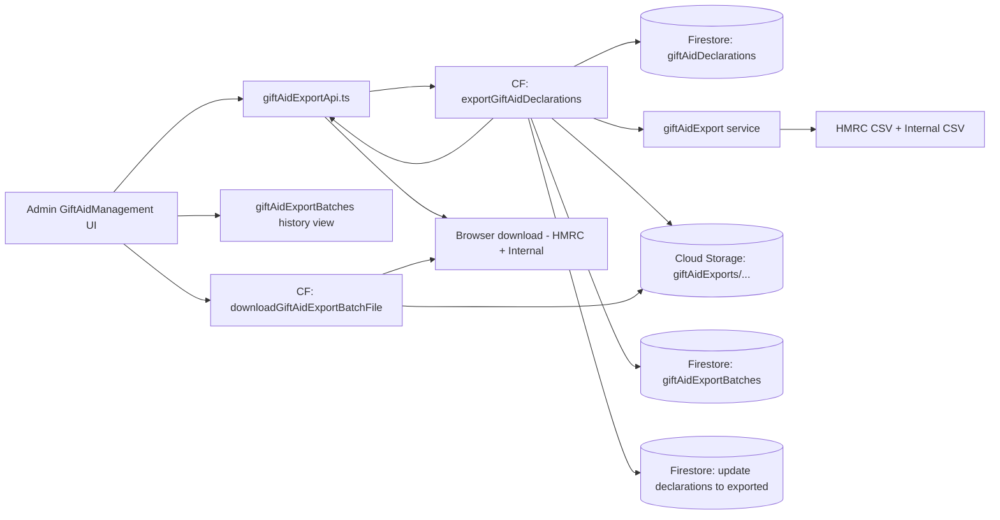
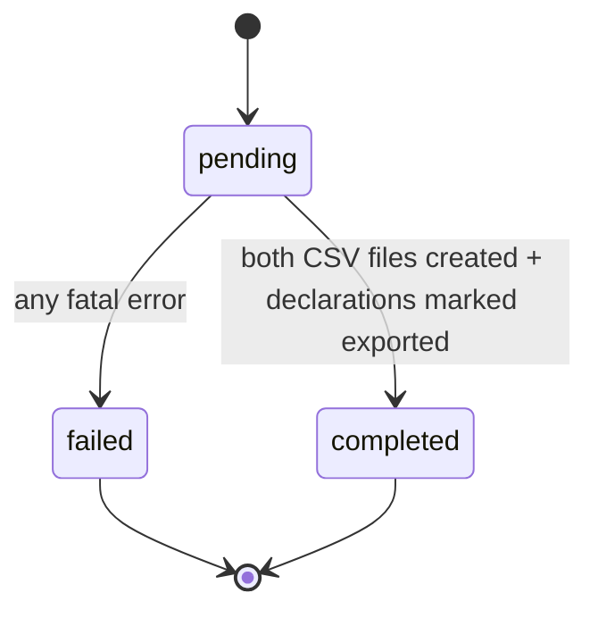
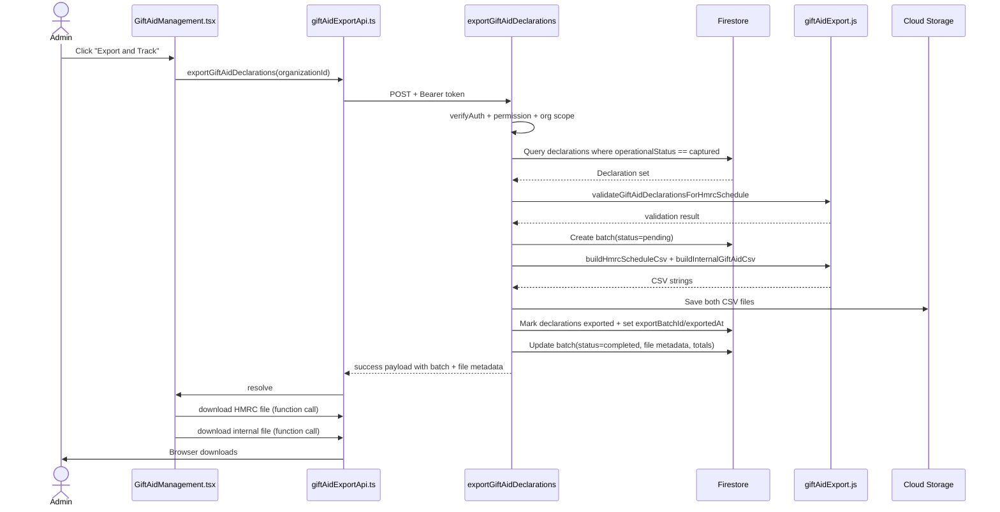

# Gift Aid Export Flow

## 1) Purpose

This document explains the Gift Aid export system end-to-end:

- what the flow does
- why each step exists
- how data moves across frontend, backend, Firestore, and Storage
- how permissioning, validation, and security controls are enforced

This is the **export** flow for Gift Aid declarations, not the donor capture flow.

---

## 2) Scope

### In Scope

- Exporting captured Gift Aid declarations as:
  - HMRC schedule CSV
  - Internal pence-based CSV
- Creating and tracking export batches
- Marking exported declarations to avoid duplicate extraction
- Re-downloading stored batch files
- CSV output security hardening

### Out of Scope

- HMRC submission API integration
- HMRC reference workflow after submission
- Gift Aid capture UI rules (covered in donor-side docs)

---

## 3) File Map

### Backend

- `backend/functions/handlers/giftAid.js`
  - `exportGiftAidDeclarations`
  - `downloadGiftAidExportBatchFile`
  - permission checks
  - batch lifecycle writes
  - storage upload/download

- `backend/functions/services/giftAidExport.js`
  - CSV column definitions
  - row-level formatting
  - HMRC required-field validation
  - CSV escaping + formula sanitization

- `backend/functions/index.js`
  - function registrations:
    - `exportGiftAidDeclarations`
    - `downloadGiftAidExportBatchFile`

### Frontend

- `src/entities/giftAid/api/giftAidExportApi.ts`
  - authenticated function calls
  - export request + batch file download request
  - history fetch from Firestore collection

- `src/views/admin/GiftAidManagement.tsx`
  - “Export and track” action
  - export history table/cards
  - cursor-based history pagination (page size `2`)
  - standardized Previous/Page/Next controls
  - role/permission-based UI behavior

---

## 4) High-Level Architecture

---

## 5) Export Batch Lifecycle

Batch status is persisted in `giftAidExportBatches`.

---

## 6) End-to-End Export Sequence

---

## 7) Permission Model

Two backend permissions are enforced separately:

1. `export_giftaid`
   - required to create new export batches
2. `download_giftaid_exports`
   - required to download files from existing batches

`system_admin` bypasses both checks.

Org scope rule:

- non-privileged users can only operate on their own organization
- privileged role path (`super_admin` in current implementation) can cross org boundary

---

## 8) Data Selection and Duplicate Prevention

Only declarations with:

- `operationalStatus == captured`

are selected for a new batch export.

After successful export, each declaration is updated with:

- `operationalStatus = exported`
- `hmrcClaimStatus = included`
- `exportBatchId`
- `exportedAt`
- `exportActorId`

This is the extraction guardrail: records already exported are no longer selected as “captured”.

---

## 9) HMRC Validation Before CSV Generation

For each declaration, required fields are checked before generating the HMRC schedule CSV:

- donor first name
- donor surname
- house number/name
- postcode
- donation date (valid + formatable)
- donation amount (> 0)

If validation fails:

- export is rejected with `400`
- response includes `validationErrors` list by declaration

This prevents writing non-compliant HMRC schedule files.

---

## 10) CSV Outputs

## 10.1 HMRC CSV

Header order:

1. `Title`
2. `First name or initial`
3. `Last name`
4. `House name or number`
5. `Postcode`
6. `Aggregated donations`
7. `Sponsored event`
8. `Donation date`
9. `Amount`

Formatting:

- date format: `DD/MM/YY`
- amount format: pounds with 2 decimals from pence

## 10.2 Internal CSV

Header order:

1. `Title`
2. `Donor First Name`
3. `Donor Surname`
4. `House Number`
5. `Address Line 1`
6. `Address Line 2`
7. `Town`
8. `Postcode`
9. `Donation Amount (Pence)`
10. `Gift Aid Amount (Pence)`
11. `Donation Date`
12. `Tax Year`
13. `Campaign Title`
14. `Donation ID`

Formatting:

- date format: `YYYY-MM-DD`
- amount fields kept in pence

---

## 11) Storage and Batch Metadata

Files are stored under:

- `giftAidExports/{organizationId}/{batchId}/...`

For each file, metadata persisted in batch includes:

- `fileName`
- `storagePath`
- optional signed `downloadUrl`
- `sha256`
- `sizeBytes`

Batch also stores:

- creator info (`createdByUserId`, email/name)
- `rowCount`
- declaration IDs
- status timestamps
- aggregate totals (`giftAidTotalPence`, `donationTotalPence`)
- export scope + format version

---

## 12) Re-Download Flow

`downloadGiftAidExportBatchFile` does:

1. auth + permission check (`download_giftaid_exports`)
2. validates `batchId` and `fileKind` (`hmrc` or `internal`)
3. loads batch doc + resolves file metadata
4. confirms file exists in storage
5. streams CSV bytes with attachment headers

This supports recovery if local copies are missing.

---

## 13) Frontend Behavior

`GiftAidManagement.tsx`:

- Export button triggers backend export and tracking flow
- Immediately attempts both file downloads after successful export
- Shows clear warning if secondary file download fails while export succeeded
- Loads export history with cursor-based pagination
- Uses a fixed export history page size of `2` batches per page
- Uses the same admin pagination controls (`Previous`, `Page N`, `Next`) on desktop and mobile
- Disables buttons based on permission + file availability + in-flight state

History source:

- `giftAidExportBatches` collection filtered by org
- primary query order: `createdAt desc`, then `__name__ desc`
- if Firestore composite index is missing, client falls back to org-filtered fetch and in-memory sort/pagination until index is created

---

## 14) Security Controls

## 14.1 Auth and Authorization

- backend-only trust boundary via Firebase token verification
- explicit permission claims
- org-scope guardrails

## 14.2 CSV Formula Injection Hardening

Problem:

- spreadsheet tools can execute formula-like cell values that begin with `=`, `+`, `-`, `@`

Mitigation now in `giftAidExport.js`:

- `sanitizeSpreadsheetFormula(value)` runs before CSV escaping
- if a string starts (including leading whitespace) with formula trigger characters, prefix with `'`
- then apply regular CSV escaping for quotes/commas/newlines

Why this is necessary:

- donor-controlled text fields (name/address/title) can otherwise become executable formulas when admins open CSV files

Outcome:

- same defensive behavior as donation export path

---

## 15) Error Handling and Operational Behavior

If export fails after batch creation:

- batch is updated to `failed`
- `failureMessage` and `failedAt` recorded

If no captured declarations exist:

- returns success with `empty: true` and a message
- no batch files are produced

If storage file missing during re-download:

- returns `404` with explicit error

---

## 16) Suggested Test Matrix

Backend service tests should cover:

- HMRC and internal CSV row formatting correctness
- formula sanitization for:
  - `=SUM(...)`
  - `+cmd`
  - `-1+2`
  - `@A1`
  - leading whitespace + formula characters
- numeric fields remain unchanged
- required-field validation output

Handler/integration tests should cover:

- permission denied paths (`403`)
- org mismatch paths (`403`)
- invalid `fileKind` (`400`)
- empty export (`empty: true`)
- batch status transitions (`pending -> completed` / `pending -> failed`)

---

## 17) Extension Guidance

## Add HMRC/Internal Columns

1. update headers in `giftAidExport.js`
2. update row builders in same order
3. ensure validation rules still satisfy HMRC requirements
4. update tests

## Change Selection Strategy

If extraction rules evolve beyond `captured`:

1. update fetch query criteria
2. update post-export mutation strategy
3. verify no duplicate inclusion across batches

## Introduce HMRC Submission Tracking

Current flow marks `hmrcClaimStatus = included` on export.  
If submission is automated later, add explicit transitions (`submitted`, `paid`) via separate workflow.

---

## 18) Quick Reference

Backend entry points:

- `exportGiftAidDeclarations`
- `downloadGiftAidExportBatchFile`

Core CSV logic:

- `backend/functions/services/giftAidExport.js`

Frontend API bridge:

- `src/entities/giftAid/api/giftAidExportApi.ts`

Admin UI:

- `src/views/admin/GiftAidManagement.tsx`
